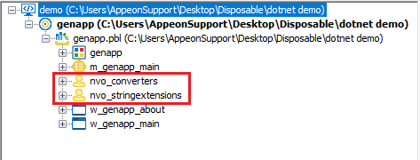

# README - Import a .NET DLL into PowerBuilder

You can download the source code for this project on [GitHub](https://github.com/Appeon/PowerBuilder-Components-Example).

1. You can use the *.NET DLL Importer* tool to quickly enable the current PowerBuilder application to use .NET DLLs

|                                                        |      |                                                              |
| :----------------------------------------------------: | :--: | :----------------------------------------------------------: |
|  |   ️   |  |
| <font size="2">Open the .NET DLL Importer Tool</font>  |      | <font size="2">Select the file and configure the import settings</font> |

2. New NVOs are added to the project, these objects wrap around the DLLs to make them usable from PowerBuilder:



3. You can now use these objects to invoke the .NET code:

```
nvo_stringextensions inv_stringExtensions
inv_stringExtensions = create nvo_stringextensions

string ls_result
ls_result = inv_stringExtensions.of_replace("Using .NET Code from ;", ";", "PowerBuilder")
// ls_result's value is now "Using .NET Code from PowerBuilder"

destroy inv_stringExtensions
```
